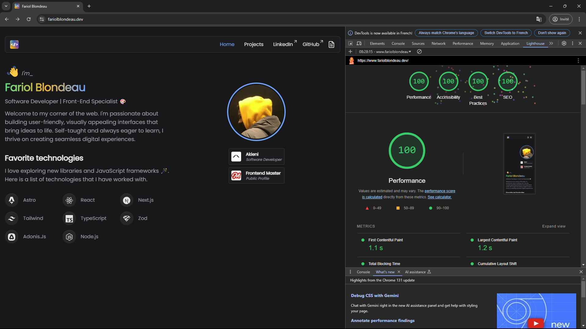

## fariolblondeau

A minimal, responsive, and accessible personal website built with [Astro](https://astro.build/) and [Tailwind CSS](https://tailwindcss.com/).




### Tech stack

- **Platform**: [Astro](https://github.com/withastro/astro)
- **Frontend Library**: [React.js](https://react.dev/)
- **Deployment**: [Vercel](https://www.netlify.com/)
- **Package manager**: [yarn](https://pnpm.io/)

### Features

- [x] Content Collection API
- [x] View Transition API
- [x] Light / Dark Mode support
- [x] SSR With Vercel as Adapter
- [x] OG image support
- [x] Vercel Analytics
- [x] Shadcn UI

### Getting started

To get started, run the following commands:

```bash
# First clone the repository
git clone https://github.com/bruxx-6243/fariolblondeau.git

# Install dependencies
pnpm install

# Start the dev server
vercel dev

```

LICENSE: [MIT](https://github.com/bruxx-6243/fariol-blondeau-resume/blob/main/LICENSE)

### Deploy

This project is deplyed on [vercel.com](vercel.com) you can preview by clicking [Here](https://fariolblondeau.dev/) !

[](https://vercel.com/new/git/external?repository-url=https%3A%2F%2Fgithub.com%2Fdatejer%2Fvercel-badge%2Ftree%2Fmaster)

[](https://astro.build)
